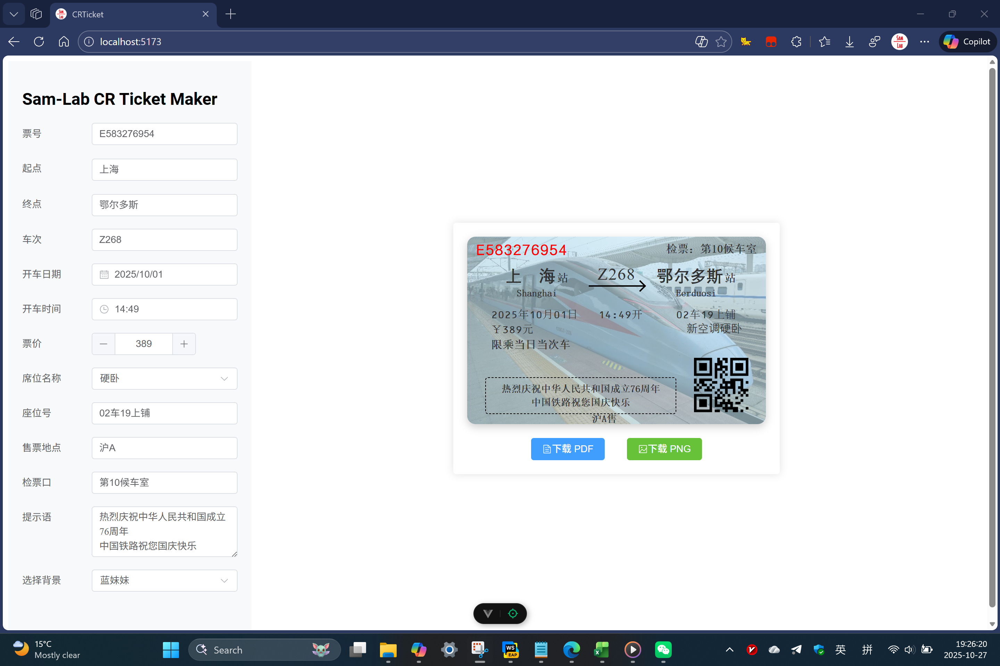
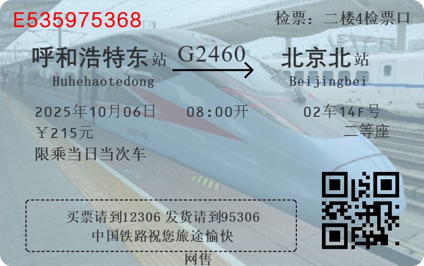
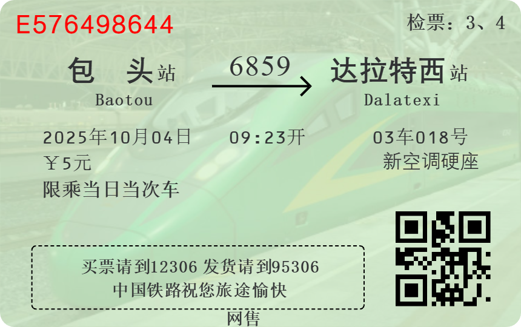
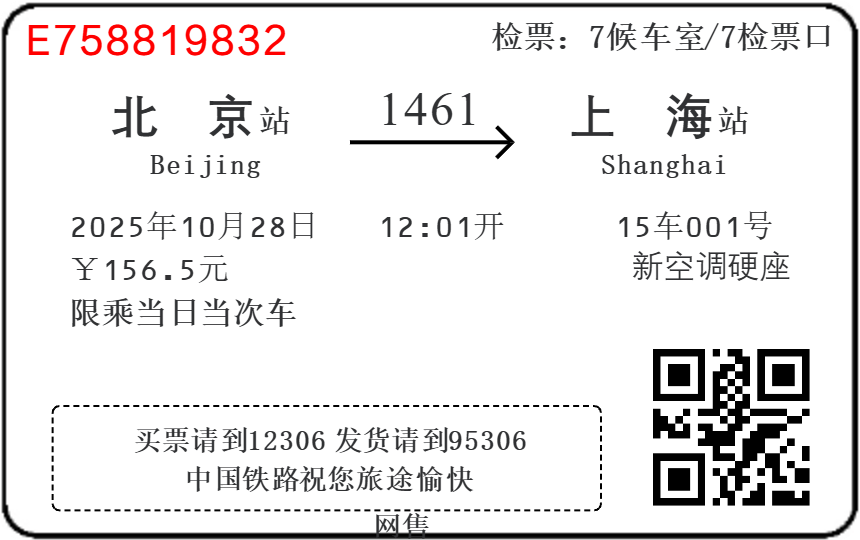

# CR Ticket Maker

## 特别提醒

**目前中国铁路要求持个人有效证件乘车，不再接受纸质车票。这个网站生成的车票无法作为乘车凭证使用！！！**



## 优点

- 可离线部署运行；
- 不记名车票，无需担心数据泄露；
- 多种背景选择。

## 使用说明

### 票号

可自定义。建议是一个字母加一串数字。

### 起点、终点

可以输入汉字、拼音、拼音首字母。输入后可在下方的弹出菜单中快速选择补全。车站列表与12306同步。不允许添加不存在的站点。

### 车次

规则：允许4位数车次。允许以5开头的5位数车次。允许以GCDZTKLYS开头，1~4位数字的车次。

### 开车时间、日期

使用Element Plus风格的时间日期选择器以选择时间。

### 票价

在输入框中可以输入>0的数字。按+-的步长为0.5.

### 席位名称

导入自12306，仅可在列表中选择。Egg: 加入了“棚车”的选项。

### 座位号、售票地、检票口、提示语

可以自定义。

### 背景

目前有数种选项。如果有自己的照片可以提交。

### 下载

可以下载到PDF或者PNG文件。

## 样例







## 构建

以下为主要依赖项及其用途说明：

- **Vue 核心 API**

  ```js
  import { onMounted, watch, reactive, ref } from 'vue'
  ```

  - `ref` 与 `reactive`：用于定义响应式数据，驱动页面动态更新。
  - `watch`：监听数据变化，触发相应逻辑。
  - `onMounted`：在组件挂载后执行初始化逻辑。

- **Element Plus 组件库**

  ```js
  import { ElMessage } from 'element-plus'
  import { Document, Picture } from '@element-plus/icons-vue'
  ```

  - `ElMessage`：用于全局消息提示，提升用户交互体验。
  - `Document`、`Picture`：来自 Element Plus 的图标组件，用于界面展示。

- **业务数据**

  ```js
  import stationData from '/src/station_name.js'
  ```

  - `stationData`：项目自定义的站点数据文件，作为业务逻辑和界面渲染的基础数据源。

- **二维码生成**

  ```js
  import QRCode from 'qrcode'
  ```

  - 用于将字符串或业务数据生成二维码，便于信息分享或打印。

- **页面截图与导出**

  ```js
  import html2canvas from 'html2canvas'
  import jsPDF from 'jspdf'
  ```

  - `html2canvas`：将页面 DOM 转换为 Canvas 图像。
  - `jsPDF`：将生成的图像或内容导出为 PDF 文件，实现报表或凭证的下载功能。

### 构建流程

1. **安装依赖**
    使用包管理工具（推荐 `npm` 或 `yarn`）安装项目依赖：

   ```bash
   npm install
   # 或
   yarn install
   ```

2. **开发环境启动**
    启动本地开发服务器，支持热更新：

   ```bash
   npm run dev
   ```

3. **生产环境构建**
    打包优化后的生产版本：

   ```bash
   npm run build
   ```

4. **预览构建结果**
    本地预览打包后的应用：

   ```bash
   npm run preview
   ```

## 提交

可以在`/public`目录下提交自己的照片。大小比例为86/54. 要求处理好上传。

不允许增加或删除站点信息。

如果您有代码优化的方案，直接提交即可。