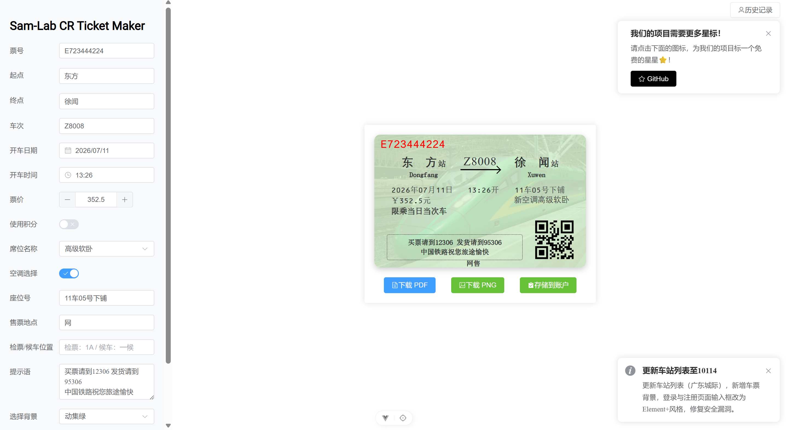
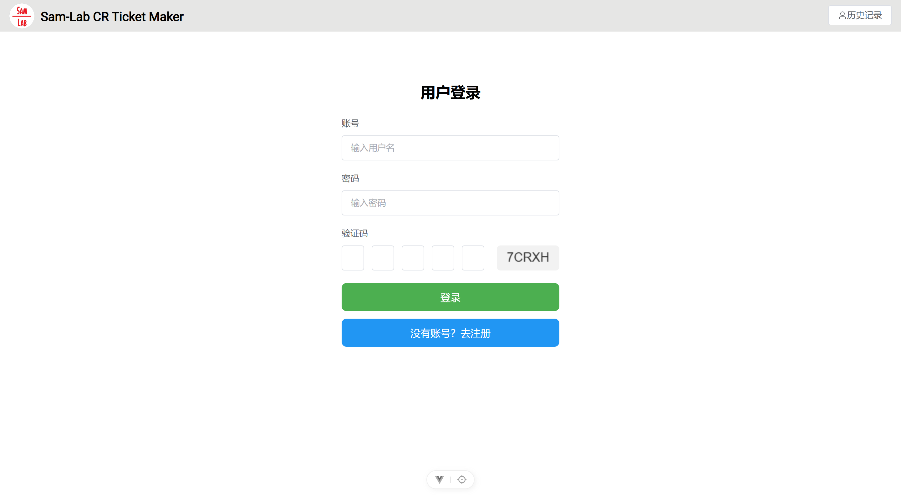
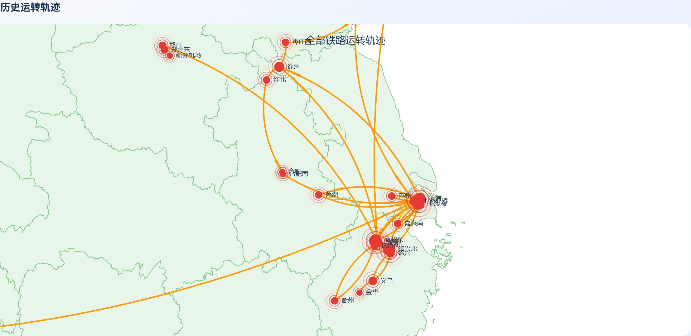

# CR Ticket Maker

## 特别提醒

**目前中国铁路要求持个人有效证件乘车，不再接受纸质车票。这个网站生成的车票无法作为乘车凭证使用！！！**

## 项目截图








## 优点

- 可离线部署运行；
- 不记名车票，无需担心数据泄露；
- 多种背景选择。

## 车票生成使用说明

### 票号

可自定义。建议是一个字母加一串数字。

### 起点、终点

可以输入汉字、拼音、拼音首字母。输入后可在下方的弹出菜单中快速选择补全。车站列表与12306同步。添加不存在的站点会导致无法生成英文。

### 车次

规则：允许4位数车次。允许以5开头的5位数车次。允许以GCDZTKLYS开头，1~4位数字的车次。

### 开车时间、日期

使用Element Plus风格的时间日期选择器以选择时间。

### 票价

在输入框中可以输入>0的数字。按+-的步长为0.5.

### 使用积分

开启开关后，车票上显示“赠”字，该车票的价格将不计入运转小结中。

### 席位名称

导入自12306，仅可在列表中选择。Egg: 加入了“棚车”的选项。

### 空调选择

开启开关后，在坐席前显示“新空调”三字。仅在席位选择合法时启用。

### 座位号、售票地、检票口、提示语

可以自定义。

### 背景

目前有数种选项。如果有自己的照片可以提交。

### 下载

可以下载到PDF或者PNG文件。

### 车票存储

在登录状态下，在完整录入完车票后，点击存储按钮可以将这张车票保存至个人账户。

### 车票里程

记录运转里程，默认不填为0. 里程将显示在运转小结中。

## 历史车票使用说明

### 登录

首次使用时，需要先登录/注册。

### 登出账户

使用完成后，点按登出即可登出账户。

### 补登记录

如果有漏下的车票记录，可以直接点按按钮录入。

### 车票记录操作

点击绿色图标即可下载这张车票，点击白色图标即可修改车票的信息，点击红色图标则可删除这张车票记录。

## 用户管理使用说明

### 登录与注册

账户名是唯一凭证，密码为加密存储在数据库内，若忘记密码将无法找回。验证码为演示，并没有防止机器人的功能。

### 用户资料修改

修改用户的头像、名称、密码。

### 用户注销

点击按钮，经过确认后可注销用户，注销后所有数据从数据库中删除，此过程不可逆！

### 用户运转图表

展示最常到达车站、最常到达城市、点亮城市、运转日期等信息。

> [!CAUTION]
>
> ### 运转地图只有`CN`（中国大陆/中国内地）, `HK`（香港）, `LA`（老挝/寮国）三个地区，没有俄罗斯、北朝鲜、越南、蒙古、台湾、澳门、哈萨克等地区，如果你是“小粉红”、“基本盘”且你的玻璃心碎了，你可以选择：
>
> - 自行在`/public/maps`下补全你想要的地图；
> - 删除`User.vue`；
> - 不使用此项目。

## 车票生成样例


## 构建

### 环境要求

- Node.js：`^20.19.0` 或 `>=22.12.0`
- npm：建议使用与 Node.js 配套的最新版本

### 安装依赖

```bash
npm install
```

### 开发模式（前端）

```bash
npm run dev
```

默认启动 Vite 开发服务器（通常为 `http://localhost:5173`）。

### 启动后端服务

```bash
node server/app.js
```

后端默认地址：`http://localhost:3000`，接口前缀如下：

- `/api/user`
- `/api/ticket`

### 生产构建

```bash
npm run build
```

构建产物输出到 `dist/` 目录。

### 本地预览构建产物

```bash
npm run preview
```

## FAQ

### Q：安装环境、启动环境时报错。

A：检查电脑已安装最新Node.js，已经运行`npm install`安装所有依赖项。

### Q：登录失败、注册失败、保存车票等失败。

A：先检查是否正确启动后端，如果还是失败请提交Issue。

### Q：在哪里获得运转里程数据

A：[路路通](https://lulutong.com)提供了一趟车次的计价里程，注意计价里程不等于实际距离。另外可以去查接算站示意图或维基百科获得。

## 提交

可以在`/public`目录下提交自己的照片。大小比例为86/54. 要求处理好上传。

不允许增加或删除站点信息。

**如果发现车站缺失或者坐标不对，请提交issue并提供缺失的车站及坐标！**

如果您有代码优化的方案，直接提交Pull Request即可。

## 未来规划

- Android等移动平台应用程式开发。
