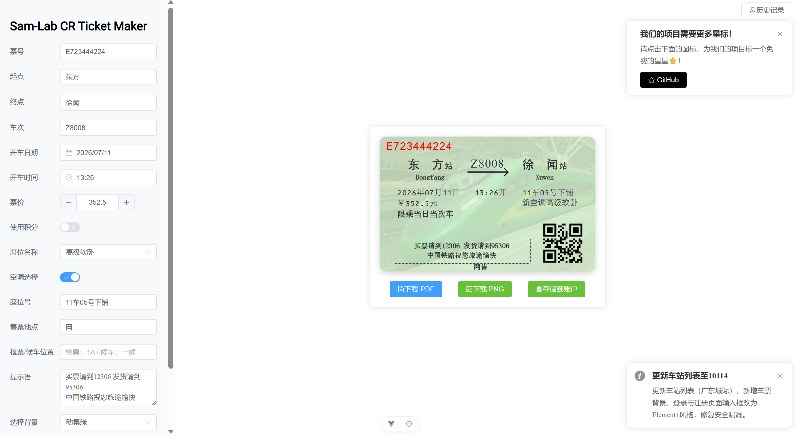
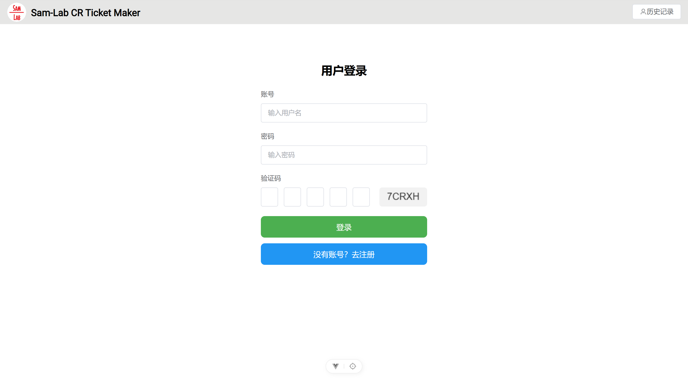
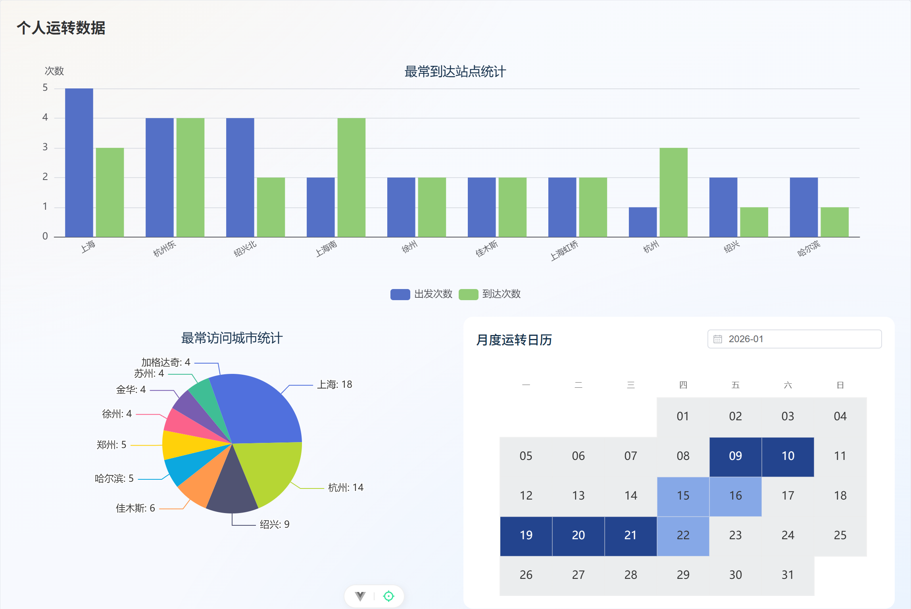
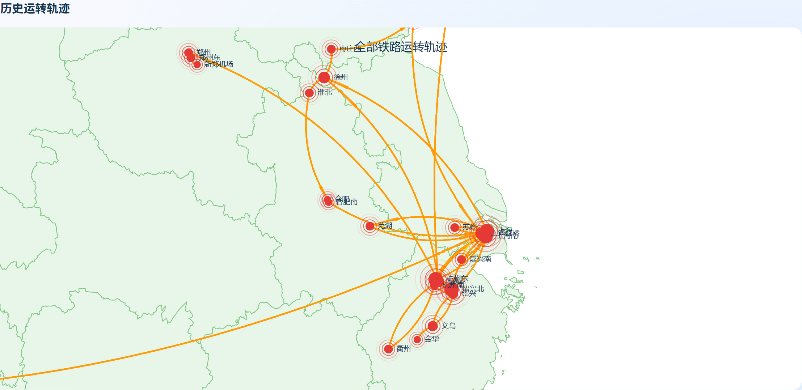
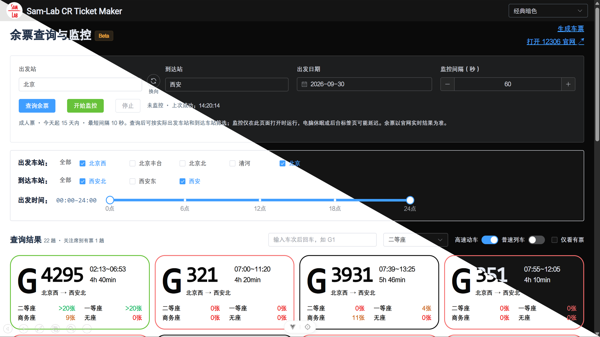
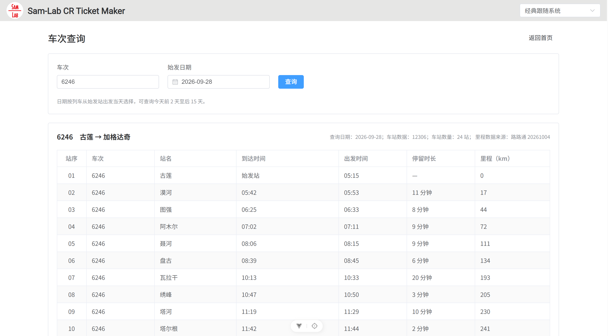
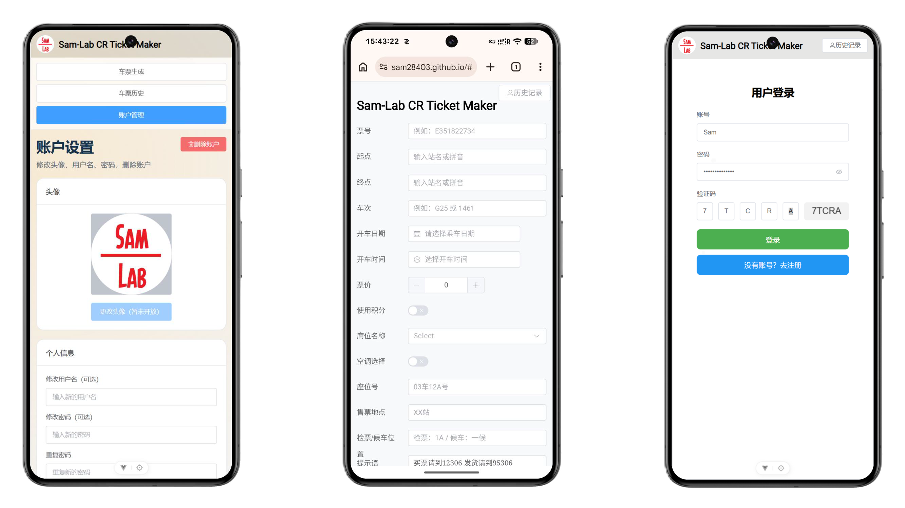
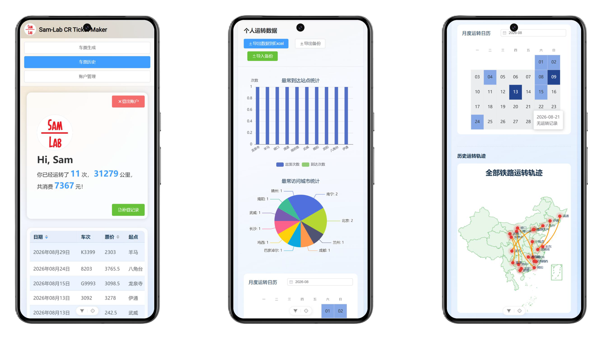
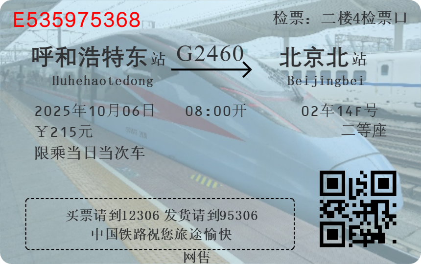

# CR Ticket Maker

## 特别提醒

**目前中国铁路要求持个人有效证件乘车，不再接受纸质车票。这个网站生成的车票无法作为乘车凭证使用！！！**

## ⭐ 我们的项目需要更多星标！

请点击右上角的图标，为我们的项目标一个免费的星星⭐！

## 前端演示网址

https://sam28403.github.io

## 项目截图











## 优点

- 可离线部署运行；
- 不记名车票，无需担心数据泄露；
- 多种背景选择。

## 项目文件结构

下面按仓库中的项目文件说明用途。`node_modules/` 是 npm 安装目录，`dist/` 是 Vite 构建目录，均为生成内容，不属于源码结构；`server/db/train.db` 是运行时 SQLite 数据库并由 Git 忽略。

### 根目录

| 文件 | 用途 |
| --- | --- |
| `index.html` | Vite 应用入口 HTML，提供 Vue 挂载节点。 |
| `package.json` | 项目元数据、Node.js 版本要求、依赖和 npm 命令。 |
| `package-lock.json` | 锁定 npm 依赖的具体版本，供安装时复现依赖树。 |
| `vite.config.js` | Vue 插件、`@` 源码别名，以及开发／预览时转发 `/api` 到本地后端。 |
| `jsconfig.json` | JavaScript 编辑器和 `@` 路径别名的项目配置。 |
| `.env.ghpages` | GitHub Pages 静态构建环境标记。 |
| `.gitattributes` | Git 对文本和换行符等文件属性的设置。 |
| `.gitignore` | 排除依赖、构建结果、数据库和本地环境文件等。 |
| `LICENSE` | 项目许可证。 |
| `SECURITY.md` | 安全问题报告指引。 |
| `README.md` | 功能介绍、使用说明、部署方法和本文件结构索引。 |
| `scripts/run-full.js` | 同时启动 Vite 前端与 Express 后端的开发／预览进程管理脚本。 |
| `.github/workflows/deploy-to-pages-repo.yml` | GitHub Actions 的 Pages 部署工作流。 |
| `.vscode/extensions.json` | 推荐的 VS Code 扩展列表。 |

### 前端：`src/`

| 文件或目录 | 用途 |
| --- | --- |
| `src/main.js` | 初始化主题、样式、Vue、Element Plus、Pinia 和路由，并挂载应用。 |
| `src/App.vue` | 应用外层组件，渲染当前路由页面。 |
| `src/api.js` | 前端 API 请求封装。 |
| `src/router/index.js` | 页面路由、部署模式下的访问限制和页面映射。 |
| `src/station_name.js` | 车站名称和电报码等车站主数据。 |
| `src/stores/user.js` | Pinia 用户状态。 |
| `src/config/deploy.js` | 读取部署目标和 API 地址等部署配置。 |
| `src/views/MainView.vue` | 车票生成首页和表单。 |
| `src/views/Monitor.vue` | 余票查询、筛选、定时监控和提醒页面。 |
| `src/views/TrainQuery.vue` | 车次经停、时间和里程查询页面。 |
| `src/views/HistoryView.vue` | 已保存车票历史及记录操作页面。 |
| `src/views/Login.vue` | 登录页面。 |
| `src/views/Register.vue` | 注册页面。 |
| `src/views/User.vue` | 用户资料、车票统计和运转地图页面。 |
| `src/views/Debug.vue` | 调试和诊断页面。 |
| `src/components/LeftTicketCard.vue` | 余票查询结果卡片。 |
| `src/components/ThemeSelect.vue` | 外观主题选择控件。 |
| `src/composables/useTheme.js` | 主题状态、系统配色同步和持久化逻辑。 |
| `src/composables/useTicketShared.js` | 车票和余票页面共用的车站搜索及表单逻辑。 |
| `src/utils/captcha.js` | 验证码相关工具。 |
| `src/utils/seatAvailability.js` | 余票席别数量及状态解析工具。 |
| `src/utils/stations.js` | 车站名称搜索和匹配工具。 |
| `src/utils/stationCoordinates.js` | 车站地理坐标主数据。 |
| `src/utils/ticketShared.js` | 前端车票数据共用处理逻辑。 |
| `src/utils/ticketExport.js` | 车票图片／PDF 导出逻辑。 |
| `src/utils/trainTime.js` | 车次经停时间和跨日展示工具。 |
| `src/utils/trainQueryDate.js` | 车次查询日期范围及格式处理。 |
| `src/utils/trainInfoPdf.js` | 车次经停信息 PDF 排版与导出。 |
| `src/utils/trainInfoPdf.test.js` | 车次 PDF 导出工具的测试。 |
| `src/assets/styles/App.css` | 应用通用样式。 |
| `src/assets/styles/theme.css` | 主题色及亮／暗色样式变量。 |
| `src/assets/styles/fonts.css` | 前端字体定义。 |
| `src/assets/styles/History.css` | 历史车票页面样式。 |
| `src/assets/styles/Login.css` | 登录和注册页面样式。 |

### 后端：`server/`

| 文件或目录 | 用途 |
| --- | --- |
| `server/app.js` | Express 服务入口，安装安全中间件并挂载各 API 路由；直接运行时监听 `127.0.0.1:3000`。 |
| `server/auth.js` | 登录身份验证和密码处理辅助逻辑。 |
| `server/security.js` | 请求来源、跨域和安全响应头等服务端安全配置。 |
| `server/security.test.js` | 服务端安全配置测试。 |
| `server/db/db.js` | SQLite 数据库连接、初始化和共享数据库设置。 |
| `server/db/train.db` | 本地运行生成的 SQLite 数据库文件，包含用户和车票记录；被 `.gitignore` 忽略。 |
| `server/routes/user.js` | 注册、登录、用户资料和账户相关 API。 |
| `server/routes/ticket.js` | 车票记录的增删改查 API。 |
| `server/routes/ticketValidation.js` | 车票输入数据校验规则。 |
| `server/routes/leftTicket.js` | 12306 余票查询 API 及官网查询流程。 |
| `server/routes/leftTicketSeats.js` | 余票席别字段解析和归一化。 |
| `server/routes/leftTicket.test.js` | 余票查询路由测试。 |
| `server/routes/lltskb.js` | 路路通车次数据库获取、缓存和经停／里程查询。 |
| `server/routes/lltskb.test.js` | 路路通数据处理测试。 |
| `server/routes/trainInfo.js` | 车次信息 API，组合 12306 与路路通查询结果。 |
| `server/routes/trainInfo.test.js` | 车次信息路由测试。 |

### 静态资源：`public/`

| 文件或目录 | 用途 |
| --- | --- |
| `public/Blank.jpg`、`Blue_Sister.jpg`、`CIT_Yellow.jpg`、`CR400BF.jpg`、`DF11.jpg`、`DF11G.jpg`、`EMU_Green.jpg`、`FXN5C.jpg`、`Harmony_White.jpg`、`Red.jpg`、`Sanya_1.jpg`、`Sanya_2.jpg` | 车票背景／装饰图片资源。 |
| `public/Picture1.png` | 项目页面使用的 PNG 图片资源。 |
| `public/GitHub.gif` | GitHub 动画图片资源。 |
| `public/consola.ttf`、`FZCDXK.TTF`、`OCRB.ttf`、`Roboto.ttf`、`google_sans_rounded_regular.ttf`、`simsun.ttf`、`times.ttf` | 页面、车票或 PDF 使用的字体文件。 |
| `public/maps/china.json`、`laos.json`、`countries.geojson` | 用户统计页面运转地图使用的地理边界数据。 |

### 仓库图片与数据文件

| 文件或目录 | 用途 |
| --- | --- |
| `Screenshot1.png`–`Screenshot9.png` | README 项目截图。 |
| `E535975368.png`、`E708794075.png`、`E741577963.png` | README 中展示的车票生成样例。 |
| `overpass_station_statuses.json`、`overpass_train_all_statuses.json`、`overpass_train_trainyes.json` | Overpass 查询得到的站点／列车状态数据文件。 |
| `station_exact_results.json`、`station_exact_progress.json`、`station_exact_missing_progress.json` | 车站精确匹配结果和处理进度数据。 |

> 站名、坐标、地图和这些 JSON 文件属于数据资源；修改前应确认数据来源和用途，避免无关的批量重写。

## 切换页面主题

在页面顶部右侧的“外观主题”下拉框中切换配色，无需登录：

- 经典跟随系统、经典亮色、经典暗色；
- 高对比度跟随系统、高对比度亮色、高对比度暗色。

默认使用“经典跟随系统”。选择“跟随系统”时，页面会随操作系统的亮色／暗色设置自动变化；选择固定亮色或暗色时则保持该配色。设置保存在当前浏览器的本地存储中，刷新后保留，并同步到同源的其他已打开页面；本地存储不可用时仍可在当前页面切换。

这里调整的是页面外观，车票背景仍在车票表单的“背景”选项中单独选择。

## 车票生成使用说明

### 票号

可自定义。建议是一个字母加一串数字。

### 起点、终点

可以输入汉字、拼音、拼音首字母。输入后可在下方的弹出菜单中快速选择补全。车站列表与12306同步。添加不存在的站点会导致无法生成英文。

### 车次

规则：允许4位数车次。允许以5开头的5位数车次。允许以GCDZTKLYS开头，1~4位数字的车次。

### 开车时间、日期

使用Element Plus风格的时间日期选择器以选择时间。

### 票价

在输入框中可以输入>0的数字。按+-的步长为0.5.

### 使用积分

开启开关后，车票上显示“赠”字，该车票的价格将不计入运转小结中。

### 席位名称

导入自12306，仅可在列表中选择。Egg: 加入了“棚车”的选项。

### 空调选择

开启开关后，在坐席前显示“新空调”三字。仅在席位选择合法时启用。

### 座位号、售票地、检票口、提示语

可以自定义。

### 背景

目前有数种选项。如果有自己的照片可以提交。

### 下载

可以下载到PDF或者PNG文件。

### 车票存储

在登录状态下，在完整录入完车票后，点击存储按钮可以将这张车票保存至个人账户。

### 车票里程

记录运转里程，默认不填为0. 里程将显示在运转小结中。

## 余票监控使用说明

在本地或自行部署的完整服务中，从首页右上角点击“余票监控”进入 `#/monitor`，无需登录。监控页标题右侧“生成车票”返回首页，下方链接可打开 12306 官网。GitHub Pages 演示版会冻结该入口，原因见下方部署说明。

### 查询与筛选

1. 输入出发站和到达站，支持汉字、拼音、首字母搜索，站名列表复用 `src/composables/useTicketShared.js`。
2. 选择今天起 15 天内的出发日期，点击“查询余票”。当前查询成人票。
3. 可点击“换向”交换出发站与到达站。查询后可多选实际出发车站、到达车站，点击对应“全部”取消该项车站筛选。
4. 出发时间按整点范围筛选，默认 `00:00–24:00`，包含起始时刻、不包含结束时刻。
5. 默认关注全部席别，可选择指定席别，或勾选“仅看有票”。有票统计和提醒还要求该车次处于可预订状态。车次按完整车次号匹配，不区分大小写；输入一个车次后按回车添加标签，多车次需逐个添加，例如先输入 `G1` 回车，再输入 `G3` 回车。
6. “高速动车”和“普速列车”开关互斥，均关闭时显示全部。当前分类规则将 Z/T/K/L 开头及纯数字车次、D1–D300、D701–D800、C1–C999、C4001–C4999 归为普速，其余归入高速动车筛选。

结果以卡片展示，手机为两列，大屏为四列；卡片只显示官网提供的席别，售罄席别仍保留。车次使用 `public/consola.ttf`，其他文字使用 `public/FZCDXK.TTF`。

- 绿色：大于 20 张；橙色：1–20 张；红色：0 张。
- 有座明细中的截断值 `21` 显示为 `>20张`，不能据此认定实际只剩 21 张；无座保留可解析的数量。
- 明细缺失或无法可靠解析时保留 `>20张`，不推算库存。查询结果是当次快照，以 12306 实时结果为准。

卡片边框另有含义：已展示席别全部无票为红色，仅无座有票为橙色，有座席别中存在大于 20 张的为绿色，其余使用默认边框。

### 定时监控

点击“开始监控”会先尝试申请浏览器通知权限，随后立即查询，再按间隔继续查询。默认间隔 60 秒，可设置为 10–3600 秒，监控中不能调整间隔；每次请求结束后才安排下一次查询，避免请求重叠。点击“停止”取消监控及正在进行的页面请求。

首次发现符合筛选条件的车次在关注席别有票，或其余票数据变化且仍有票时，页面弹出提醒，并保留最近 30 条提醒；变为无票时不发送有票提醒。允许通知后还会发送浏览器系统通知，点击通知可聚焦页面；不支持通知、未授权或发送失败时，仍保留页面内提醒。

提醒关注所选车站、出发时间、车次、车种与席别。修改这些筛选条件会清空提醒记录及上次比较状态，下次监控查询会重新判断有票情况；“仅看有票”只控制结果显示。修改出发站、到达站、日期（包括换向）会停止监控并清空查询结果和提醒。

监控只在当前页面打开时运行，离开页面会停止。电脑休眠、后台标签页可能延迟查询；浏览器通知不代表后台常驻监控，也不提供服务端手机推送。

查询失败会自动停止，保留上次成功结果并标明可能过期；排除问题后需手动重试。最短间隔不代表不会触发官网限流，遇到限流应降低查询频率。

### 服务依赖与排错

本地使用需同时运行 `npm run dev` 和 `node server/app.js`。Vite 将 `/api` 请求转发到 `http://127.0.0.1:3000`，余票接口为 `GET /api/left-ticket?from=BJP&to=SHH&date=YYYY-MM-DD`（站点参数为电报码）。

后端读取官网初始化页面确定当前查询接口，字段及数量解析保存在 `server/routes/leftTicket.js`、`server/routes/leftTicketSeats.js`。参考脚本为 [12306 余票查询脚本](https://kyfw.12306.cn/otn/resources/merged/queryLeftTicket_end_js.js)，运行时不执行远程脚本。官网接口变化、网络异常或验证页均可能导致查询失败。

如页面无法获取余票，先确认后端已启动、API 地址和跨域配置正确，再检查后端能否访问 12306。

## 车次查询使用说明

在本地或自行部署的完整服务中，点击首页右上角“车次查询”进入 `#/train`，无需登录。输入车次并选择始发日期（北京时间今天前 2 天至后 15 天），即可查看车次、站名、到达时间、出发时间、停留时长和里程。跨日到达时间用 `+1`、`+2` 等标签标注；手机端以卡片展示经停信息。

查询优先使用 12306 车次接口；无结果时尝试路路通数据。12306 不提供里程时，若路路通车站序列可准确对应，则补充路路通里程，否则显示“暂无”。点击结果下方“导出数据”可按模板导出 A4 PDF，文件名为 `车次_日期.pdf`，优先采用 14 号字；站点较多时采用 12 号字，仍无法容纳时分页。导出使用 `public/google_sans_rounded_regular.ttf`。

车次查询需要运行 `node server/app.js`：前端通过 `/api/train-info?train=G1&date=YYYY-MM-DD` 请求后端，后端再访问 12306 和路路通。路路通数据按需检查版本：服务进程缓存数据，每隔 1 小时在下一次查询时读取 `android.ver`；版本变化才下载新的 `an.db`，查询并非每次都下载最新数据库。若检查或下载失败，约 1 分钟后下一次查询会重试。

GitHub Pages 演示版不部署后端，因此禁用首页“车次查询”入口，并将直接访问 `#/train` 重定向至首页。

## 历史车票使用说明

### 登录

首次使用时，需要先登录/注册。

### 登出账户

使用完成后，点按登出即可登出账户。

### 补登记录

如果有漏下的车票记录，可以直接点按按钮录入。

### 车票记录操作

点击绿色图标即可下载这张车票，点击白色图标即可修改车票的信息，点击红色图标则可删除这张车票记录。

## 用户管理使用说明

### 登录与注册

账户名是唯一凭证，密码为加密存储在数据库内，若忘记密码将无法找回。验证码为演示，并没有防止机器人的功能。

### 用户资料修改

修改用户的头像、名称、密码。

### 用户注销

点击按钮，经过确认后可注销用户，注销后所有数据从数据库中删除，此过程不可逆！

### 用户运转图表

展示最常到达车站、最常到达城市、点亮城市、运转日期等信息。

> [!CAUTION]
> 
> ### 运转地图只有`CN`（中国大陆/中国内地）, `HK`（香港）, `LA`（老挝/寮国）三个地区，没有俄罗斯、北朝鲜、越南、蒙古、台湾、澳门、哈萨克等地区，如果你是“小粉红”、“基本盘”且你的玻璃心碎了，你可以选择：
> 
> - 自行在`/public/maps`下补全你想要的地图；
> - 删除`User.vue`；
> - 不使用此项目。

## 车票生成样例




## 构建

### 环境要求

- Node.js：`^20.19.0` 或 `>=22.12.0`
- npm：建议使用与 Node.js 配套的最新版本

### 安装依赖

```bash
npm install
```

### 开发模式（前端）

```bash
npm run dev
```

默认启动 Vite 开发服务器（通常为 `http://localhost:5173`）。

### 启动后端服务

```bash
node server/app.js
```

后端默认地址：`http://localhost:3000`，接口前缀如下：

- `/api/user`
- `/api/ticket`
- `/api/left-ticket`

### 生产构建

```bash
npm run build
```

构建产物输出到 `dist/` 目录。

### GitHub Pages 演示版构建（受限功能）

> GitHub Pages 仅托管静态前端。12306 余票接口不允许来自 `sam28403.github.io` 的跨域请求，也不提供可用的预检响应；浏览器会按同源策略拦截请求。Service Worker、前端 JavaScript 或把解析脚本放进仓库都不能绕过这一限制。车次查询还需要后端访问 12306 和路路通，因此演示版冻结余票监控与车次查询入口。

该模式下会做如下限制：

- 仅允许访问生成车票首页（`#/`）；`#/monitor`、`#/train`、`#/history`、`#/login`、`#/register`、`#/user`、`#/debug` 及其他路径均重定向回首页；
- `MainView` 右上角“余票监控”、“车次查询”和“历史记录”按钮均禁用；
- 车票预览下方“存储到账户”按钮禁用。

构建方式：

```bash
npm run build:ghpages
```

其本质是使用 Vite 的 `--mode ghpages` 加载根目录下的 `.env.ghpages`，其中包含：

```bash
VITE_DEPLOY_TARGET=github
```

余票监控与车次查询仍可在本地完整服务中使用。若未来另行部署 HTTPS 后端代理，可在构建时将 `VITE_API_BASE_URL` 指向该服务，并在后端 `ALLOWED_ORIGINS` 中加入 Pages 域名；完成部署和安全验证后，再单独放开 `/monitor` 和 `/train`。不要使用公开 CORS 代理：查询内容和访问来源会交给第三方，稳定性与限流也无法控制。

仓库现有 GitHub Actions 工作流为 `.github/workflows/deploy-to-pages-repo.yml`。当前工作流不部署 `server/app.js`，GitHub Pages 也不会提供本地 Vite 的 `/api` 代理，所以构建产物会保持余票监控与车次查询入口冻结。

### 本地预览构建产物

```bash
npm run preview
```

## FAQ

### Q：安装环境、启动环境时报错。

A：检查电脑已安装最新Node.js，已经运行`npm install`安装所有依赖项。

### Q：登录失败、注册失败、保存车票等失败。

A：先检查是否正确启动后端，如果还是失败请提交Issue。

### Q：在哪里获得运转里程数据

A：[路路通](https://www.lltskb.com)提供了一趟车次的计价里程，注意计价里程不等于实际距离。另外可以去查接算站示意图或维基百科获得。

## 提交

可以在`/public`目录下提交自己的照片。大小比例为86/54. 要求处理好上传。

不允许增加或删除站点信息。

**如果发现车站缺失或者坐标不对，请提交issue并提供缺失的车站及坐标！**

如果您有代码优化的方案，直接提交Pull Request即可。

## 未来规划

- Android等移动平台应用程式开发。
